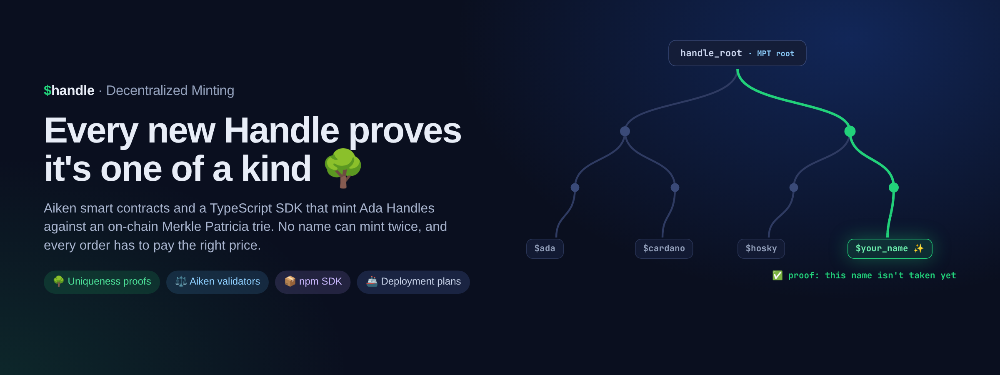
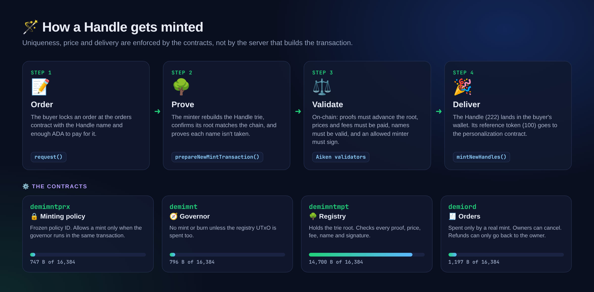

<p align="center"></p>

<p align="center">
  <a href="#-how-a-handle-gets-minted">🪄 How it works</a> ·
  <a href="#-use-the-sdk">📦 SDK</a> ·
  <a href="#-deploying-contracts">🚢 Deploy</a> ·
  <a href="#-local-validation">🧪 Validate</a> ·
  <a href="docs/index.md">📚 Docs</a>
</p>

🪪 **Ada Handles** are readable names for Cardano wallets, like `$koralabs`. Each one is an NFT, and there can only ever be one of each.

🌳 **De-Mi** (Decentralized Minting) makes that rule part of the chain itself. Every Handle that has ever minted is a key in a Merkle Patricia trie, and only the trie's root hash is stored on-chain. To mint a new name, the transaction has to prove the name isn't in the trie yet and update the root in the same step. The contracts also check the price, the fees, the name's characters and who signed, so the server that builds the transaction can't create a duplicate or skip the price.

This repo holds the **Aiken smart contracts** and the **TypeScript SDK** that builds transactions for them.

## 🪄 How a Handle gets minted



## ✨ What's inside

| | |
| --- | --- |
| 🔒 **Frozen minting policy** | `demimntprx` never changes, so the Handle policy ID never changes. It delegates every decision to a governor |
| 🌳 **On-chain registry** | `demimntmpt` holds the trie root and validates every proof, price, fee and name |
| 🧾 **Orders** | `demiord` lets buyers request a Handle, cancel it, or get refunded only to themselves |
| 💸 **Pricing and discounts** | Prices by rarity, with on-chain discount rules and treasury and minter fees |
| 🏷️ **SubHandles and labels** | NFT and virtual SubHandles, plus label assets tracked in the same registry |
| ♻️ **Legacy migration** | Brings original (pre-De-Mi) Handles into the registry, and burns them through it |
| 📦 **TypeScript SDK** | Builds order, mint, burn, deploy and staking transactions |
| 🚢 **Deployment plans** | Compares desired settings with what's live and produces unsigned transactions |

## 📦 Use the SDK

```sh
npm install @koralabs/handles-decentralized-minting
```

| Step | Function |
| --- | --- |
| 📝 Request a Handle | `request({ network, address, handle })` |
| ❌ Cancel an order | `cancel({ network, address, orderTxInput })` |
| 🔎 Find open orders | `fetchOrdersTxInputs(...)`, `isValidOrderTxInput(...)` |
| 🌳 Prepare a mint (proofs, fees, redeemers) | `prepareNewMintTransaction(...)` |
| 🎉 Mint the Handles | `mintNewHandles(...)` |
| ♻️ Legacy Handles | `prepareLegacyMintTransaction(...)` |
| 🚀 Deploy and stake contracts | `deploy(...)`, `registerStakingAddress(...)` |
| 🌲 Rebuild the registry trie | `buildTrie([{ name, labels }])`, `fillHandles(trie, [{ name, labels }])` |

The SDK reads Handle, script and settings data from [api.handle.me](https://github.com/koralabs/api.handle.me) and UTxOs from Blockfrost. The [PRD](docs/product/prd.md) and [feature matrix](docs/product/feature-matrix.md) list everything it exports. Upgrading from 3.x? See the [SDK 4 migration](docs/spec/sdk-4-migration.md).

## 🚢 Deploying contracts

Deployments are planned, not hand-built. The plan compares the desired state in `deploy/<network>/decentralized-minting.yaml` with what's on-chain, then writes unsigned transactions for new reference scripts, settings changes and, when the registry contract changes, moving the trie root to the new address.

```sh
npm run deployment-plan:preview   # or :preprod / :mainnet
```

See [scripts/README.md](scripts/README.md) for required environment variables and signing order.

## 🧪 Local validation

```sh
npm test               # SDK tests (vitest)
npm run test:aiken     # contract tests (aiken check)
npm run build
npm run validate:sdk-package   # packed-package type and runtime checks
npx vitest run tests/deploymentState.test.ts tests/deploymentPlan.test.ts
```

## 🗂️ Project structure

```
decentralized-minting
├── smart-contract/              Aiken: governor, registry and orders validators
├── smart-contract-mint-proxy/   Aiken: the frozen minting policy
├── src/                         TypeScript SDK
├── scripts/                     Deployment planning
└── deploy/                      Desired state per network
```

## 📚 Documentation

- [Docs index](docs/index.md)
- [Product docs](docs/product/index.md)
- [Technical spec](docs/spec/index.md)
- [What each contract protects](docs/spec/contract-protections.md)
- [Contract sizes and execution costs](docs/spec/aiken-cost-baseline.md)
- [Data model](docs/spec/data-model.md)
